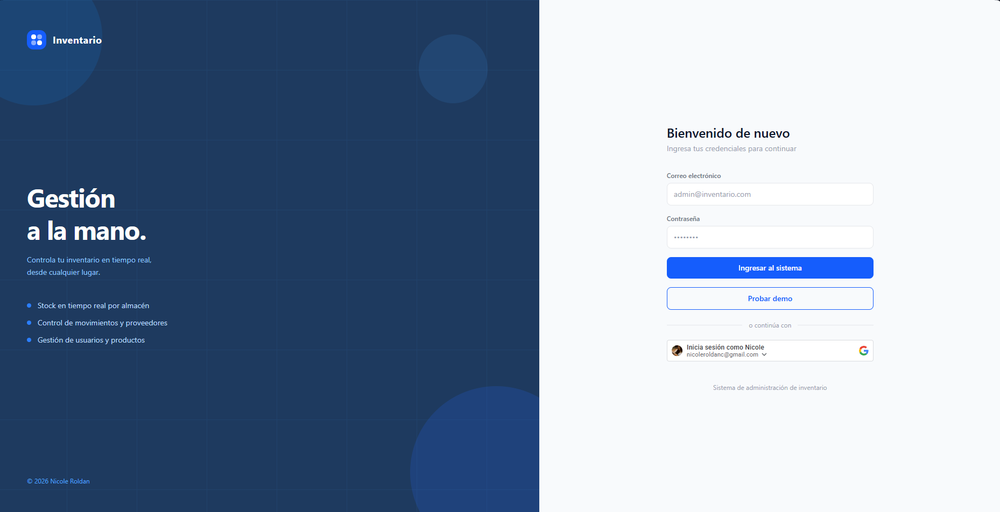
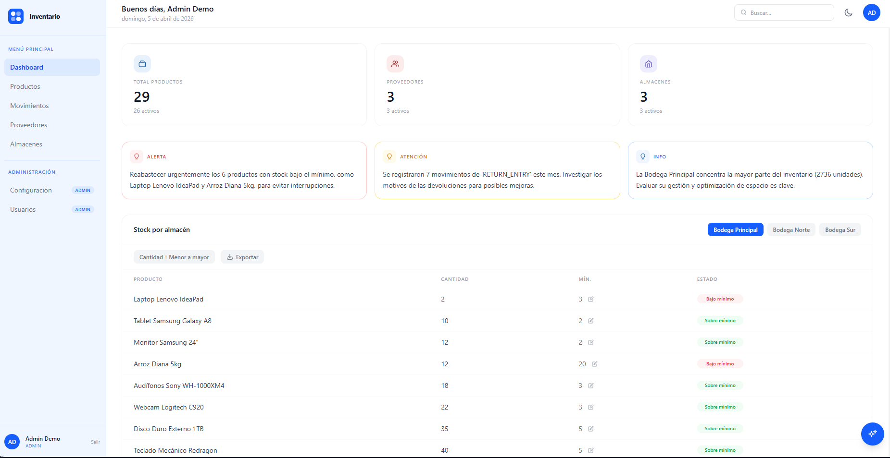
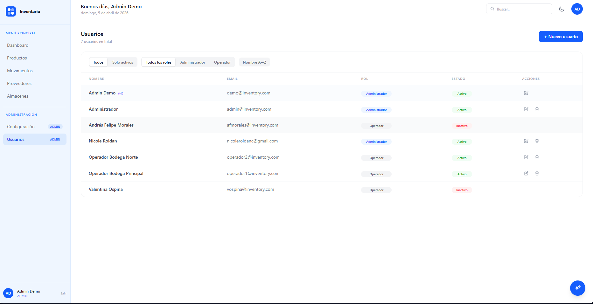

# Inventory System — Frontend
 
React frontend for the Inventory Management System. Built with Vite, Tailwind CSS v4, and TanStack Query.
 
**[Live Demo](https://inventory.nicoleroldan.com)** · **[Backend Repository](https://github.com/nicolerol28/inventory-system-backend)** · **[Frontend Repository](https://github.com/nicolerol28/inventory-system-frontend)**
 
> Demo credentials — click **"Probar demo"** ("Try demo") on the login page for instant access with pre-seeded data. Data resets nightly.
 
---

## Screenshots

### Login


### Dashboard with AI Insights


### Products — Table View


### Products — Catalog View


### Product Detail Modal


### Inventory Movements


### Suppliers


### Warehouses


### Settings — Categories


### Settings — Units


### Users


---
 
## Table of Contents
 
 - [Screenshots](#screenshots)
- [Tech Stack](#tech-stack)
- [Features](#features)
- [Architecture](#architecture)
- [Running Locally](#running-locally)
- [Author](#author)
 
---
 
 
## Tech Stack
 
| | |
|---|---|
| Framework | React 19 + Vite |
| Styling | Tailwind CSS v4 |
| Server State | TanStack Query v5 |
| HTTP | Axios with interceptors |
| Routing | React Router v7 |
| Auth | JWT (jwt-decode) + Google OAuth 2.0 |
| Charts | Recharts |
| Export | ExcelJS |
| Deploy | Vercel |
 
---
 
## Features
 
- **Dashboard** — KPI cards, AI-powered inventory insights, stock-by-warehouse table with editable minimums, low-stock chart
- **Products** — table and catalog view with product images, filters, pagination, search, Excel export
- **Movements** — inventory movements per warehouse with date range filter and export
- **Suppliers / Warehouses** — full CRUD with filters
- **Settings** — categories and measurement units (admin only)
- **Users** — admin-only user management (ADMIN / OPERATOR roles)
- **AI Assistant** — floating chat panel that persists across all routes, powered by Gemini 2.5 Flash
- **Dark mode** — toggle with localStorage persistence
- **Lazy loading** — all routes code-split via `React.lazy` + `Suspense`
- **Demo access** — one-click login with pre-seeded data, resets nightly
 
---
 
## Architecture
 
```
src/
├── api/          # One module per resource + axiosClient with auth interceptors
├── context/      # AuthContext — JWT state + login/logout
├── hooks/        # useAuth, useDarkMode
├── components/   # Layout, SearchableSelect, ProtectedRoute, AdminRoute
├── pages/        # One file per route (all lazy-loaded)
└── utils/        # exportExcel.js
```
 
| Concern | Approach |
|---|---|
| Server state | TanStack Query (`useQuery` + `useMutation`) — no Redux or Zustand |
| Auth state | `AuthContext` exposes `user`, `login`, `logout`; JWT stored in `localStorage`, decoded with `jwt-decode` |
| HTTP | Axios with a request interceptor (injects Bearer token) and a response interceptor (catches 401s) |
| Route protection | `<ProtectedRoute>` requires a valid JWT; `<AdminRoute>` requires `role === "ADMIN"` |
| Performance | All routes lazy-loaded via `React.lazy` + `Suspense` for faster initial load |
| Dark mode | `useDarkMode()` hook toggles Tailwind `dark` class on `#root` and persists preference in `localStorage` |
 
**401 re-auth flow:** 401 responses from the backend trigger a re-authentication modal (`ReAuthModal`) via a global Axios response interceptor — the session is preserved and the user can log in again without losing their current route.
 
---
 
## Running Locally
 
```bash
git clone https://github.com/nicolerol28/inventory-system-frontend
cd inventory-system-frontend
cp .env.example .env
npm install
npm run dev
```
 
**Required environment variables:**
 
```env
VITE_API_URL=http://localhost:8080/api/v1
VITE_GOOGLE_CLIENT_ID=your_google_oauth_client_id
```
 
> The backend must be running locally. See the [backend repository](https://github.com/nicolerol28/inventory-system-backend) for setup instructions.
 
---
 
## Author
 
**Nicole Roldan** · [nicoleroldan.com](https://nicoleroldan.com) · [GitHub](https://github.com/nicolerol28)